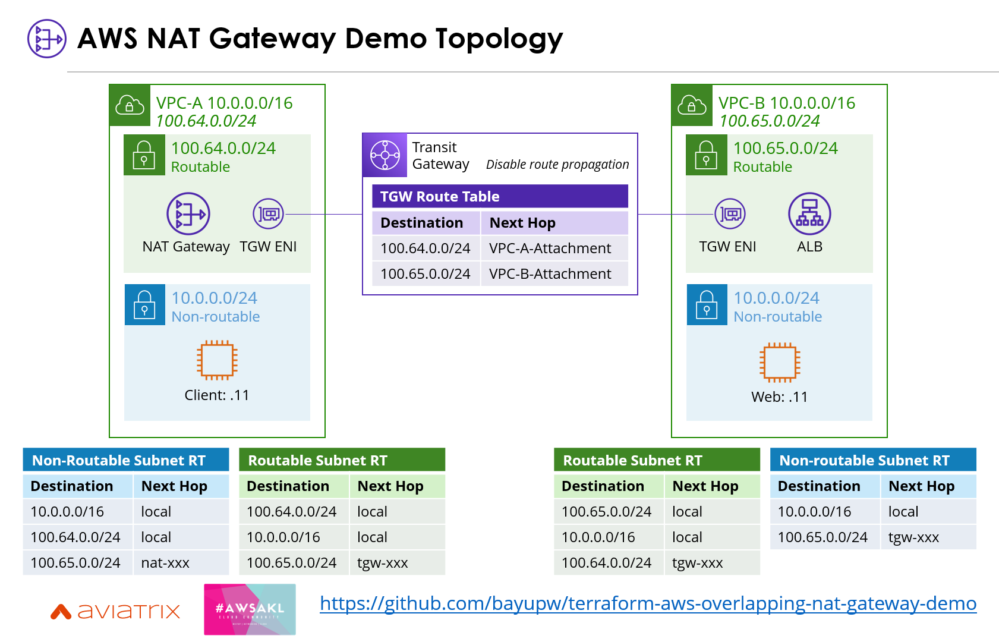

# Terraform AWS Overlapping IP NAT Gateway Demo 

Terraform code to demonstrate how AWS NAT Gateway can be used to solve overlapping IP in AWS.


## Environment Variables

To run this project, you will need to set the following environment variables

## Run Locally

Clone the project

```bash
git clone https://github.com/bayupw/terraform-aws-overlapping-nat-gateway-demo.git
```

Go to the project directory

```bash
cd terraform-aws-overlapping-nat-gateway-demo
```

Set environment variables

```bash
export AWS_ACCESS_KEY_ID="A1b2C3d4E5"
export AWS_SECRET_ACCESS_KEY="A1b2C3d4E5"
export AWS_DEFAULT_REGION="ap-southeast-2"
```

Terraform workflow

```bash
terraform init
terraform plan
terraform apply -auto-approve
```

## Contributing

Report issues/questions/feature requests on in the [issues](https://github.com/bayupw/terraform-aws-overlapping-nat-gateway-demo/issues/new) section.

## License

Apache 2 Licensed. See [LICENSE](https://github.com/bayupw/terraform-aws-overlapping-nat-gateway-demo/tree/master/LICENSE) for full details.